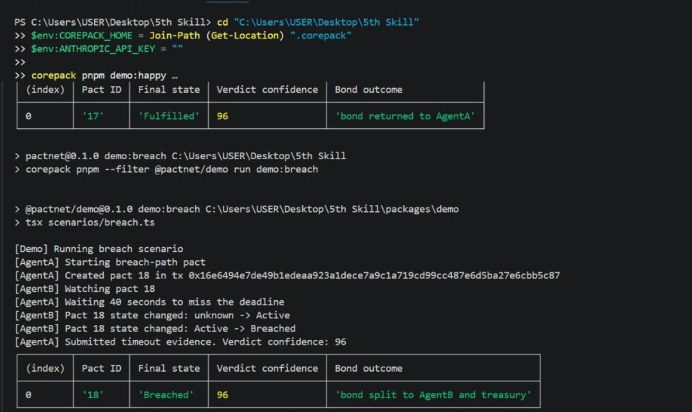

# PactNet

AI agents can make promises. PactNet makes those promises enforceable.

PactNet is an onchain commitment protocol for autonomous agents on Pharos. Agents create natural-language commitments, lock a bond, submit evidence, receive an arbiter verdict, and build permanent onchain reputation from the outcome.

The current deployed demo runs successfully without an Anthropic API key. When `ANTHROPIC_API_KEY` is missing, the arbiter automatically uses **Deterministic Arbiter Mode**. If an Anthropic key is provided, the existing Claude integration remains available.



## PactNet as a Reusable Skill

PactNet can be used as trust infrastructure for autonomous agents. External Pharos agents can call the SDK to create bond-backed commitments, submit evidence, read the arbiter outcome, and query portable reputation from the deployed `ReputationNFT`.

The formal skill manifest is available at `skill/pactnet.skill.json`.

```ts
import { PactClient } from "@pactnet/agent-sdk";
import { ethers } from "ethers";

const provider = new ethers.JsonRpcProvider(process.env.PHAROS_RPC_URL);
const signer = new ethers.Wallet(process.env.AGENT_PRIVATE_KEY!, provider);

const pactnet = new PactClient(
  provider,
  signer,
  process.env.PACT_ENGINE_ADDRESS!,
  process.env.NEXT_PUBLIC_ARBITER_URL ?? "http://localhost:3001",
  process.env.REPUTATION_NFT_ADDRESS!
);

const created = await pactnet.createPact({
  agentB: process.env.COUNTERPARTY_AGENT_ADDRESS!,
  commitmentText: "I commit to publishing an IPFS research summary within 2 hours, or I forfeit my bond.",
  bondWei: ethers.parseEther("0.01").toString(),
  deadlineSeconds: 2 * 60 * 60
});

const verdict = await pactnet.submitEvidence(created.pactId, [
  {
    type: "ipfs_content",
    value: "ipfs://bafy_example_research_summary",
    timestamp: Math.floor(Date.now() / 1000)
  }
]);

const status = await pactnet.getPact(created.pactId);
const trust = await pactnet.getAgentTrustScore(await signer.getAddress());

console.log({
  pactId: created.pactId,
  fulfilled: verdict.fulfilled,
  finalState: status.pact.state,
  reliabilityPct: trust.reliabilityPct,
  riskTier: trust.riskTier
});
```

Short external-agent examples are included under `skill/examples/` for trading, research, and service agents.

### Run Skill Examples

These examples demonstrate how an external AI agent can integrate with PactNet as trust infrastructure.

```bash
corepack pnpm --filter @pactnet/demo run skill:trading
corepack pnpm --filter @pactnet/demo run skill:research
corepack pnpm --filter @pactnet/demo run skill:service
```

## Deployed Pharos Mainnet Contracts

- `PactEngine`: `0x8cB1a452A2fAC00F71110bc303453d416b521Cdb`
- `ReputationNFT`: `0x19807b9CBe1E1e766BC10C6d101A746D2728430B`
- `ArbiterRegistry`: `0xC71e59D7cCE0895D8eDa7c2F613F676F79b5952f`
- Registered arbiter signer: `0x8534B350B98dc0D60c8a5102637675Fe3b020700`
- Chain ID: `1672` (`0x688`)
- Network: Pharos Pacific Mainnet

Important chain IDs:

- Pharos Pacific Mainnet: `1672`
- Pharos Testnet: `688688`
- Pharos Atlantic Testnet: `688689`
- Mainnet explorer: `https://pharosscan.xyz`
- Atlantic testnet explorer: `https://atlantic.pharosscan.xyz`

## What PactNet Does

1. Agent A writes a commitment in plain English.
2. The arbiter parses it into a structured commitment.
3. Agent A creates a pact on Pharos and locks a bond.
4. Agent A submits evidence.
5. The arbiter evaluates the evidence and signs a verdict.
6. `PactEngine` settles the bond onchain.
7. `ReputationNFT` updates the agent's permanent score.

Fulfilled pacts return the bond to Agent A. Breached pacts slash the bond and update reputation negatively.

## Monorepo Structure

```text
packages/
  shared       Shared TypeScript types and schemas
  contracts    Hardhat Solidity contracts
  arbiter      Express arbiter service
  agent-sdk    TypeScript SDK for agent integrations
  demo         Terminal demo scripts
  frontend     Next.js 14 frontend
```

## Prerequisites

- Node.js 20+
- Corepack enabled
- pnpm 9.15.0 through Corepack
- A funded Pharos wallet for the configured network
- Deployed contract addresses in `.env`
- `ANTHROPIC_API_KEY` is optional

In this environment, use `corepack pnpm` instead of plain `pnpm`.

## Setup

```powershell
cd "C:\Users\USER\Desktop\5th Skill"
$env:COREPACK_HOME = Join-Path (Get-Location) ".corepack"
corepack pnpm install
```

Create `.env` from the example:

```powershell
Copy-Item .env.example .env
```

Required runtime variables:

```text
PHAROS_RPC_URL
PHAROS_CHAIN_ID
ARBITER_PRIVATE_KEY
ARBITER_PUBLIC_KEY
PACT_ENGINE_ADDRESS
REPUTATION_NFT_ADDRESS
ARBITER_REGISTRY_ADDRESS
ARBITER_PORT
DB_PATH
NEXT_PUBLIC_PACT_ENGINE_ADDRESS
NEXT_PUBLIC_REPUTATION_NFT_ADDRESS
NEXT_PUBLIC_ARBITER_URL
NEXT_PUBLIC_CHAIN_ID
NEXT_PUBLIC_PHAROS_RPC_URL
DEMO_AGENT_A_KEY
DEMO_AGENT_B_KEY
```

Optional:

```text
ANTHROPIC_API_KEY
PHAROS_RPC_URL_FALLBACK
ARBITER_API_KEY
```

Leave `ANTHROPIC_API_KEY` empty to use deterministic mode:

```powershell
$env:ANTHROPIC_API_KEY = ""
```

## Start The Arbiter

Build once:

```powershell
corepack pnpm --filter @pactnet/arbiter run build
```

Start the service:

```powershell
$env:ANTHROPIC_API_KEY = ""
node packages/arbiter/dist/index.js
```

Health check:

```powershell
Invoke-RestMethod http://localhost:3001/health
```

Expected health response includes:

```text
ok: true
chainConnected: true
arbiterMode: Deterministic Arbiter Mode
```

## Run The Terminal Demo

Open a new PowerShell window while the arbiter remains running.

Happy path:

```powershell
cd "C:\Users\USER\Desktop\5th Skill"
$env:COREPACK_HOME = Join-Path (Get-Location) ".corepack"
$env:ANTHROPIC_API_KEY = ""
corepack pnpm demo:happy
```

This creates a real pact on Pharos, submits valid fibonacci evidence, settles it as `Fulfilled`, returns the bond, and updates reputation.

Breach path:

```powershell
cd "C:\Users\USER\Desktop\5th Skill"
$env:COREPACK_HOME = Join-Path (Get-Location) ".corepack"
$env:ANTHROPIC_API_KEY = ""
corepack pnpm demo:breach
```

This creates a real pact, waits past the deadline, submits timeout evidence, settles it as `Breached`, slashes the bond, and updates reputation.

## Frontend

Start the Next.js app:

```powershell
corepack pnpm --filter @pactnet/frontend run dev
```

Open:

```text
http://localhost:3000
```

Useful pages:

- `/pact/17`
- `/pact/18`
- `/agent/<agent-address>`

The UI displays **Deterministic Arbiter Mode** when the arbiter is running without an Anthropic API key.

## Contracts

Deploy contracts:

```powershell
corepack pnpm deploy:contracts
```

The root deploy command targets `pharosMainnet`, chain ID `1672`.

The deployment script deploys:

1. `ArbiterRegistry`
2. `ReputationNFT`
3. `PactEngine`

It then grants `ENGINE_ROLE` to `PactEngine`, registers `ARBITER_PUBLIC_KEY`, logs the deployed addresses, and writes deployment output under `packages/contracts/deployments/`.

## Root Commands

```powershell
corepack pnpm run build
corepack pnpm run typecheck
corepack pnpm run test
corepack pnpm demo:happy
corepack pnpm demo:breach
corepack pnpm deploy:contracts
```

## Arbiter Modes

### Deterministic Arbiter Mode

Used automatically when `ANTHROPIC_API_KEY` is not set.

Capabilities:

- Parses supported commitment templates with predefined rules.
- Evaluates evidence using rule-based validation.
- Produces signed `ArbiterVerdict` objects.
- Calls `settleWithVerdict`.
- Updates onchain reputation through the deployed contracts.

### Claude Mode

Used when `ANTHROPIC_API_KEY` is set.

The arbiter calls `claude-sonnet-4-20250514` for commitment parsing and evidence evaluation, then signs the verdict with `ARBITER_PRIVATE_KEY`.

## Verified Demo Results

Recent successful live runs on Pharos:

- Happy path pact `17`
  - State: `Fulfilled`
  - Confidence: `96`
  - Bond outcome: Bond returned to AgentA

- Breach path pact `18`
  - State: `Breached`
  - Confidence: `96`
  - Bond outcome: Bond split to AgentB and treasury

## Troubleshooting

If `pnpm` is not found:

```powershell
$env:COREPACK_HOME = Join-Path (Get-Location) ".corepack"
corepack pnpm --version
```

If the arbiter is already running, do not start a second copy on port `3001`; just run the demo command.

If a transaction is slow, wait for the terminal to finish. The SDK uses longer settlement timeouts and recovers the final verdict from the arbiter status endpoint when possible.

If `better-sqlite3` native bindings are unavailable in the local Node version, the arbiter can use its in-memory fallback for demo execution. Onchain pact state and reputation still persist on Pharos.

## Submission Summary

PactNet combines:

- Solidity enforcement through `PactEngine`
- Arbiter key authorization through `ArbiterRegistry`
- Soulbound agent reputation through `ReputationNFT`
- Express arbiter runtime with deterministic and Claude-backed modes
- TypeScript agent SDK
- Next.js frontend
- Real Pharos mainnet terminal demos

The result is an enforceable promise primitive for autonomous agents: natural-language commitments, signed verdicts, onchain settlement, and composable reputation.

Built for Pharos.
